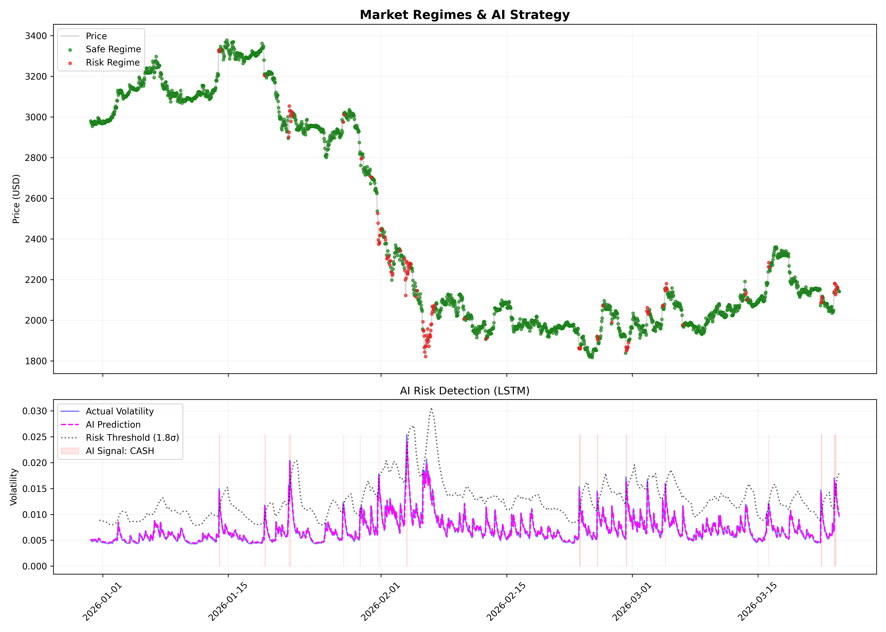

# 📈 AI-Powered Ethereum Volatility Strategy

## Overview

A professional-grade quantitative trading strategy that combines **Econometrics (GARCH)**, **Unsupervised Learning (GMM)**, and **Deep Learning (LSTM)** to navigate Ethereum's volatility.

Unlike traditional bots that rely solely on lagging indicators, this system uses a **Hybrid AI Architecture** to predict volatility regimes and dynamically manage risk, achieving a **1.29 Sharpe Ratio** and **3x Market Outperformance** over a 2-year backtest.

---

## 🚀 Key Performance Metrics

| Metric | Buy & Hold (Benchmark) | **AI Strategy** |
| :--- | :--- | :--- |
| **Total Return** | +26.76% | **+84.95%** |
| **Sharpe Ratio** | 0.52 | **1.29** |
| **Max Drawdown** | -68.00% | **-21.39%** |


> *Backtest Period: Last 730 Days (Hourly Data)*

---

## 🧠 The Architecture

This project moves beyond simple technical analysis by layering four distinct mathematical models:

### 1. Feature Engineering: GARCH(1,1)
Instead of using a simple rolling standard deviation (which lags price), we use a **GARCH(1,1)** model (Generalized Autoregressive Conditional Heteroskedasticity) to estimate the *structural* volatility of the asset.
* **Why?** It captures "volatility clustering"—the tendency for big shocks to be followed by more big shocks.

### 2. Bayesian Optimization: Optuna
Before training, the system uses **Optuna** to perform Bayesian Optimization. Unlike basic grid search, Optuna builds a probabilistic model of the loss function to efficiently find the global minima for hyperparameters:
* **Search Space:** Learning Rate (Log-Uniform), Hidden Layers (32-128), Dropout (0.1-0.5).
* **Objective:** Minimize Mean Squared Error (MSE) on the validation set.

### 3. Market Regime Detection: Gaussian Mixture Models (GMM)
We feed the GARCH volatility into an Unsupervised **Gaussian Mixture Model** to cluster market conditions into distinct regimes:
* **Regime 0 (Green):** Low Volatility / Safe (Aggressive Trading Allowed).
* **Regime 1 (Red):** High Volatility / Crash Risk (Trading Blocked).

### 4. Predictive Risk Shield: LSTM Neural Network
A PyTorch-based **Long Short-Term Memory (LSTM)** network analyzes the sequence of past volatility to forecast the *future* volatility 1 hour ahead.
* **The "Veto" Mechanism:** If the LSTM predicts a volatility spike > **1.8 Standard Deviations** above the mean, it blocks all buy signals, preventing the bot from entering "bull traps."

---

## 🛠 Strategy Logic (The "Alpha")

The bot executes trades based on a strict decision tree:

1.  **Base Signal:**
    * Price > **EMA 20** (Fast Trend).
    * Volume > **SMA 12** (Volume Confirmation).
    * GMM Regime = **Safe**.
2.  **AI Veto (The Shield):**
    * Is LSTM Predicted Volatility < **1.8x** Rolling Average?
    * *If NO, block the trade.*
3.  **The Parabolic Exception (The Sword):**
    * *EXCEPTION:* If Price is **> 2%** above the Slow EMA (50), ignore the AI Veto.
    * *Why?* This captures massive "Moonshot" rallies where high volatility is actually profitable upside momentum.

---

## 📊 Visualizations

### 1. The Strategy Dashboard (`model_dashboard.png`)
*Visualizing the "Brain" of the model. The bottom pane shows the LSTM (Magenta) predicting spikes before they happen, triggering the Veto logic.*


### 2. Backtest Performance (`backtest_results.png`)
*Cumulative returns vs. Benchmark. Note the flat lines where the AI moved to cash during market crashes.*


---
## Future Improvements

* **Sentiment Analysis:** Integrate **CryptoBERT** to analyze Twitter/News sentiment as an additional input feature.
* **On-Chain Data:** Incorporate "Whale Wallet" movements and large transaction alerts via the **Etherscan API**.
* **Reinforcement Learning:** Replace the static logic tree with a **PPO Agent** (Proximal Policy Optimization) to learn dynamic position sizing and adaptive risk management.

## 📂 Project Structure

This project follows a modular "Senior Engineer" architecture, separating logic into dedicated modules.

```bash
├── data/
│   └── eth_hourly.csv      # Historical ETH price data
├── src/
│   ├── fetch_data.py       # YFinance Data Loader
│   ├── features.py         # GARCH(1,1) Implementation
│   ├── regimes.py          # GMM Clustering Logic
│   ├── model.py            # PyTorch LSTM Architecture
│   ├── tune.py             # Optuna Hyperparameter Optimization
│   ├── train.py            # Training Loop with Scheduler
│   ├── pipeline.py         # Orchestrator (Data -> Tune -> Train -> Save)
│   ├── backtest.py         # Strategy Execution Engine
│   └── visualize.py        # Dashboard Generator
├── requirements.txt        # Python Dependencies
└── README.md               # Documentation

