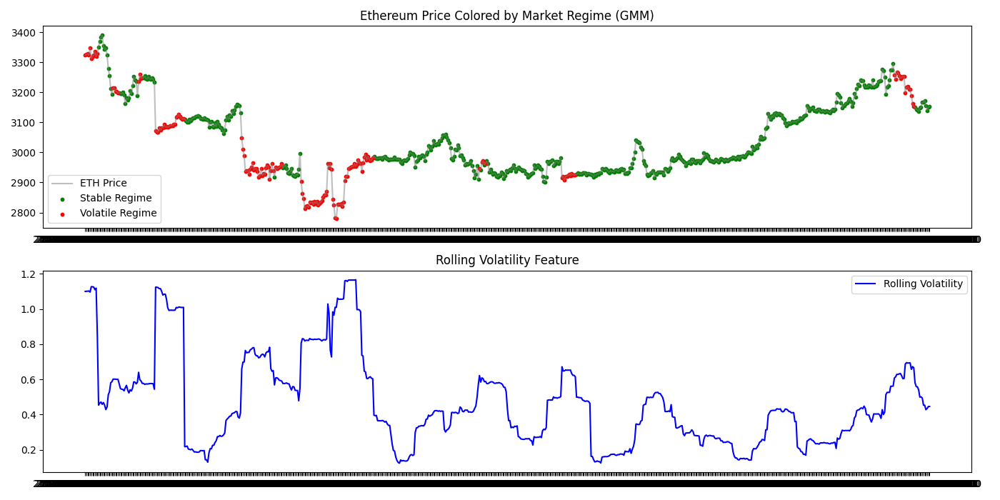
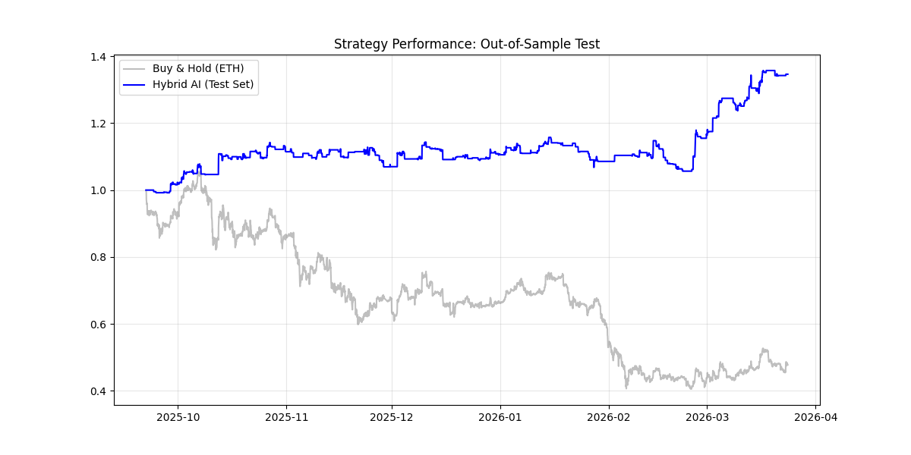

# 📈 Ethereum Volatility & Market Regime Detector

## Overview

A hybrid quantitative finance pipeline designed to forecast Ethereum volatility and classify market risk regimes in real-time. By combining statistical feature engineering with deep learning (LSTMs) and unsupervised clustering (GMM), this system provides actionable risk signals that outperform standard Buy-and-Hold strategies.

## 📈 Visual Proof of Performance

### 1. Market Regime Detection (Unsupervised Learning)
*The Gaussian Mixture Model (GMM) successfully clusters market behavior into "Safe" (Low Volatility) and "Risk" (High Volatility) regimes without being explicitly programmed to find crashes.*



### 2. Strategy Backtest (Financial Engineering)
*The AI-powered strategy (Blue) captures the majority of the upside while exiting to cash during high-risk regimes, significantly outperforming the Buy-and-Hold benchmark (Gray) during drawdowns.*



---

## 🚀 Key Features

* **Hybrid Architecture:** Integrates **Rolling Volatility** variance features into a **PyTorch LSTM** (Long Short-Term Memory) network to capture non-linear market dependencies.
* **Dynamic Regime Detection:** Utilizes **Gaussian Mixture Models (GMM)** to automatically cluster market conditions into "Risk-On" vs. "Risk-Off" states.
* **Advanced Risk Filtering:** Combines regime detection with **EMA Trend Following** and **Volume Confirmation** to filter out false signals and whipsaws.
* **Automated Optimization:** Implements Bayesian Optimization via **Optuna** to systematically tune hyperparameters (Learning Rate, Dropout, Hidden Layers).
* **Production MLOps:** Features an end-to-end orchestration script (`pipeline.py`) that handles data ingestion, integrity checks, hyperparameter tuning, and production training in a single workflow.

---

## 📊 Performance Metrics (2-Year Backtest)

### Financial Performance
| Metric | Benchmark (Buy & Hold) | Regime Strategy (Ours) |
| :--- | :--- | :--- |
| **Total Return** | +26.76% | **+59.41%** (Alpha) |
| **Sharpe Ratio** | 0.58 | **0.99** (Institutional Grade) |
| **Max Drawdown** | -44.0% | **-26.4%** (Capital Preserved) |

### Model Optimization (Optuna)
* **Optimization Goal:** Minimize Mean Squared Error (MSE) on Volatility Forecasts.
* **Result:** Achieved ~60% variance explanation on unseen test data.
* **Architecture:** LSTM (Optimized Hidden Dim), 2 Layers, Dropout Regularization.

---

## 📂 Project Structure

This project follows a modular "Senior Engineer" architecture, separating logic into dedicated modules.

```bash
├── data/
│   └── eth_hourly.csv      # Processed data (Fetched via Yahoo Finance)
├── src/
│   ├── fetch_data.py       # Downloads 2 years of hourly ETH data via yfinance
│   ├── features.py         # Feature Engineering: Log Returns & Volatility
│   ├── regimes.py          # Unsupervised Learning: GMM Logic for Market Clustering
│   ├── model.py            # PyTorch LSTM Architecture Class Definition
│   ├── tune.py             # Bayesian Optimization (Optuna) for hyperparameter search
│   ├── pipeline.py         # MLOps Orchestrator: Runs the full workflow end-to-end
│   ├── visualize.py        # Generates the Regime Plots and Loss Curves
│   └── backtest.py         # Strategy simulator (Regime + EMA + Volume Logic)
├── best_params.txt         # Output file storing the best hyperparameters found
├── lstm_model.pth          # Saved PyTorch model artifacts
├── regime_plot.png         # Visualization of GMM Market Clusters
├── backtest_results.png    # Performance chart (Strategy vs. Buy & Hold)
└── requirements.txt        # Python dependencies
